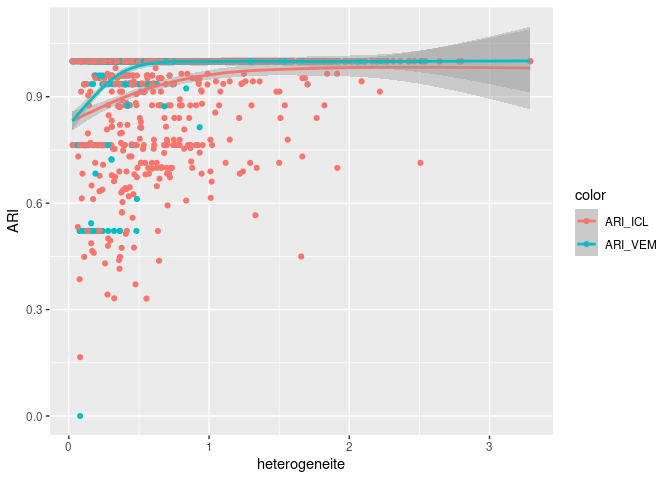

<!-- README.md is generated from README.Rmd. Please edit that file -->

# SBMStudy

<!-- badges: start -->

<!-- badges: end -->

SBMStudy regroups tools to generate Stochastic Block Model (SBM) or mixture of SBMs and compare multiples techniques of inference.

## Installation

You can install the development version of SBMStudy from [GitHub](https://github.com/) with:

``` r
install.packages("devtools")
devtools::install_github("Myosis-R/SBMStudy")
```

## Dependencies

``` r
install.packages('purrr')
install.packages('gtools')
install.packages('dplyr')
install.packages('FixedPoint')
install.packages('parallel')
install.packages('doParallel')
install.packages('foreach')
install.packages('itertools')
devtools::install_github('GrossSBM/sbm')
install.packages('graphclust')
devtools::install_github('Chabert-Liddell/colSBM')
```

## Quick walk around SBMStudy

Most useful functions : 

-	gen_sbm : Compare inference algorithms on a given graph

-	gen_mix_sbm : Compare inference algorithms on a collection of graphs

-	gen_vfold : Compare inference algorithms on a given graph using cross-validation
technique

-	vem_f : implementation of variationnal expectation-maximization algorithm. 

-	exICL_f : implementation of exact integrated complete likelihood algorithm. 

## Example 1 : gen_sbm

We analyse inference on a thousand of networks with fifty nodes. The output of gen_sbm is a dataframe where each row is a new network and each column is the result of a criterion on a given inference.

Criteria :

-	heterogen (measure of the heterogeneity of interactions between classes)

-	ARIs (Ajusted Rank Index between infered nodes memberships and truth)

-	cl_diff (Number of infered classes minus truth)

-	ICLs (Only for exICL algo, returns exICL end value)

Models :

1.	package sbm

2.	package sbm with the constrain of 3 classes

3.	exICL with a random initialization

4.	exICL with another random initialization

5.	exICL with another random initialization

``` r
res = SBMStudy::gen_sbm(N=50,R=1000)
glimpse(res)
#> Rows: 1,000
#> Columns: 16
#> $ heterogen1 <dbl> 0.1495155, 0.4313122, 0.9344674, 0.5292490, 0.6704411, 0.14…
#> $ ARI1       <dbl> 1.0000000, 1.0000000, 1.0000000, 1.0000000, 1.0000000, 0.76…
#> $ ARI2       <dbl> 1.0000000, 1.0000000, 1.0000000, 1.0000000, 1.0000000, 1.00…
#> $ ARI3       <dbl> 0.7637719, 0.8732270, 1.0000000, 1.0000000, 1.0000000, 0.47…
#> $ ARI4       <dbl> 0.9523109, 0.9433526, 1.0000000, 0.7533640, 1.0000000, 0.76…
#> $ ARI5       <dbl> 0.7637719, 0.9361569, 1.0000000, 0.8078207, 1.0000000, 0.76…
#> $ cl_diff1   <dbl> 0, 0, 0, 0, 0, -1, 0, 0, 0, 0, 0, 0, 0, 0, 0, 0, 0, 0, 0, 0…
#> $ cl_diff2   <dbl> 0, 0, 0, 0, 0, 0, 0, 0, 0, 0, 0, 0, 0, 0, 0, 0, 0, 0, 0, 0,…
#> $ cl_diff3   <dbl> -1, 1, 0, 0, 0, 1, 1, 2, 0, 1, 1, 0, 1, 1, 0, 1, 0, 1, 0, 0…
#> $ cl_diff4   <dbl> 1, 1, 0, 1, 0, -1, 0, 1, 0, 0, 0, 2, 0, 0, 0, 0, 0, 0, 0, 1…
#> $ cl_diff5   <dbl> -1, 1, 0, 1, 0, -1, 0, 0, 0, 0, 0, 0, 1, 0, 0, 0, 1, 2, 1, …
#> $ ICLs1      <dbl> 0, 0, 0, 0, 0, 0, 0, 0, 0, 0, 0, 0, 0, 0, 0, 0, 0, 0, 0, 0,…
#> $ ICLs2      <dbl> 0, 0, 0, 0, 0, 0, 0, 0, 0, 0, 0, 0, 0, 0, 0, 0, 0, 0, 0, 0,…
#> $ ICLs3      <dbl> -1354.3378, -1475.2757, -1054.2997, -1412.8720, -1241.0748,…
#> $ ICLs4      <dbl> -1339.0121, -1472.7594, -1054.2997, -1424.4788, -1241.0748,…
#> $ ICLs5      <dbl> -1354.3378, -1472.9188, -1054.2997, -1422.9137, -1241.0748,…
```

``` r
fig1 = tibble(heterogeneite = res$heterogen1, ARI_VEM = res$ARI1, ARI_ICL = res$ARI3) %>%
  pivot_longer(c(ARI_VEM,ARI_ICL),names_to = 'color', values_to = 'ARI')
ggplot(fig1)+aes(heterogeneite,ARI,color=color)+geom_point()+geom_smooth()
#> `geom_smooth()` using method = 'gam' and formula = 'y ~ s(x, bs = "cs")'
```



## Example 2 : gen_mix_sbm

A collection of graphs is generated according to a mixture of SBM, parameters are contained in thetaMix. If not given thetaMix is generated randomly at each loop.

``` r
thetaMix = list(
  list(pi=c(0.45,0.55),gamma=matrix(c(.6,.3,.2,.5),2,2),prop=0.5),
  list(pi=c(0.3,0.3,0.4),gamma=matrix(c(.1,.3,.5,.01,.5,.1,.1,.5,.6), 3,3),prop=0.5)
)
res = SBMStudy::gen_mix_sbm(N=30,K=0,M=10,C=0,R=2,thetaMix = thetaMix)
glimpse(res)
#> Rows: 2
#> Columns: 7
#> $ heterogen1  <dbl> 0, 0
#> $ clust_ARIs1 <dbl> 1, 1
#> $ clust_ARIs2 <dbl> 0.7216495, 1.0000000
#> $ clust_diff1 <dbl> 0, 0
#> $ clust_diff2 <dbl> 1, 0
#> $ nodes_ARIs1 <dbl> 0.4942748, 0.2798346
#> $ nodes_ARIs2 <dbl> 0.8232216, 0.9582247
```

Criteria :

-	heterogen (for each cluster, measure the heterogeneity of interactions between classes, return the minimum)

-	nodes_ARIs (Average nodes ARI over all graphs)

-	clust_ARIs (Ajusted Rank Index between infered network memberships and truth)
 
Models :

1.	package colSBM

2.	package graphclust

## example 3 : gen_vfold

This is a cross-validation method applied to graph. Nodes are divided in a train group and a test group. inference of nodes membership is done on the train set. Nodes in the test set are affected to a class thanks to their connections with the train set. Finally edges probabilities between nodes in the test set are derived from the infered parameters on the train set.

``` r
res = SBMStudy::gen_vfold(50,10)
glimpse(res)
#> Rows: 10
#> Columns: 3
#> $ heterogen1 <dbl> 1.9848356, 0.2306304, 0.8299266, 1.4431610, 0.4147935, 1.10…
#> $ vfolds1    <dbl> 0.2547431, 0.2283714, 0.3220425, 0.2926298, 0.1876247, 0.15…
#> $ vfolds2    <dbl> 0.2371359, 0.2362541, 0.3304364, 0.2978252, 0.1983241, 0.16…
```

Criteria :

-	heterogen (measure the heterogeneity of interactions between classes)

-	vfolds (Prediction error over egdes, nodes are split between train and test set)
 
Models :

1.	package sbm

2.	exICL with a random initialization

## Bibliography

-   exICL algorithm : P. Louche 2012

-   vfold algorithm : L. Zhang 2019

-   package sbm : J. Chiquet, S. Donnet, P. Barbillon

-   package colSBM : S-C. Chabert-Liddell, P. Barbillon, S. Donnet

-   package graphclust : T. Rebafka
